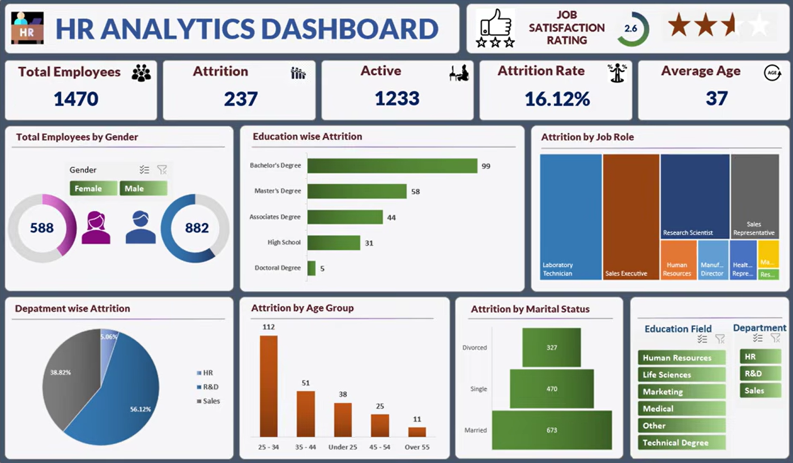

#  HR Analytics Dashboard

An interactive **HR Analytics Dashboard** built using **Microsoft Excel** to analyze employee workforce data, monitor attrition trends, and provide actionable insights for HR decision-making.

---

##  Overview

This HR Analytics Dashboard was created in **Microsoft Excel** using Pivot Tables, Pivot Charts, Slicers, Conditional Formatting, and Excel formulas. It provides valuable insights into employee demographics, attrition patterns, workforce distribution, and job satisfaction through an interactive dashboard.

---

##  Features

- Employee Overview
  - Total Employees
  - Active Employees
  - Attrition Count
  - Attrition Rate

- Workforce Demographics
  - Gender Distribution
  - Average Employee Age
  - Marital Status Analysis

- Attrition Analysis
  - Department-wise Attrition
  - Job Role-wise Attrition
  - Education-wise Attrition
  - Age Group-wise Attrition

- HR KPIs
  - Job Satisfaction Rating
  - Employee Retention Metrics

- Interactive Filters
  - Department
  - Education Field
  - Gender

---

##  Dashboard KPIs

| KPI | Value |
|------|--------|
| Total Employees | 1470 |
| Active Employees | 1233 |
| Attrition | 237 |
| Attrition Rate | 16.12% |
| Average Age | 37 |
| Job Satisfaction | 2.6 / 5 |

---

##  Dashboard Visualizations

- KPI Cards
- Donut Charts
- Bar Charts
- Treemap
- Pie Chart
- Horizontal Bar Charts
- Interactive Slicers

---

##  Tools & Technologies

- Microsoft Excel
- Pivot Tables
- Pivot Charts
- Slicers
- Conditional Formatting
- Excel Formulas

---

##  Key Insights

### Employee Distribution

- Total Employees: **1,470**
- Male Employees: **882**
- Female Employees: **588**

### Attrition Insights

- Overall Attrition Rate: **16.12%**
- The **25–34 years** age group has the highest attrition.
- Employees with a **Bachelor's Degree** have the highest attrition count.
- **Laboratory Technicians** and **Sales Executives** experience the highest employee turnover.

### Department Analysis

- **R&D** has the highest attrition.
- **Sales** records the second-highest attrition.
- **HR** has the lowest attrition among all departments.

---

##  Business Benefits

This dashboard helps HR teams to:

- Monitor employee turnover trends.
- Identify departments and job roles with high attrition.
- Analyze workforce demographics.
- Support data-driven HR decisions.
- Improve employee retention strategies.

---

##  Dashboard Preview

---

##  Future Improvements

- Employee Performance Analysis
- Salary & Compensation Dashboard
- Recruitment Analytics
- Automated Data Refresh
- Power Query Integration
- Power BI Version

---

## 👨‍💻 Author

**Ajay Kumar**
